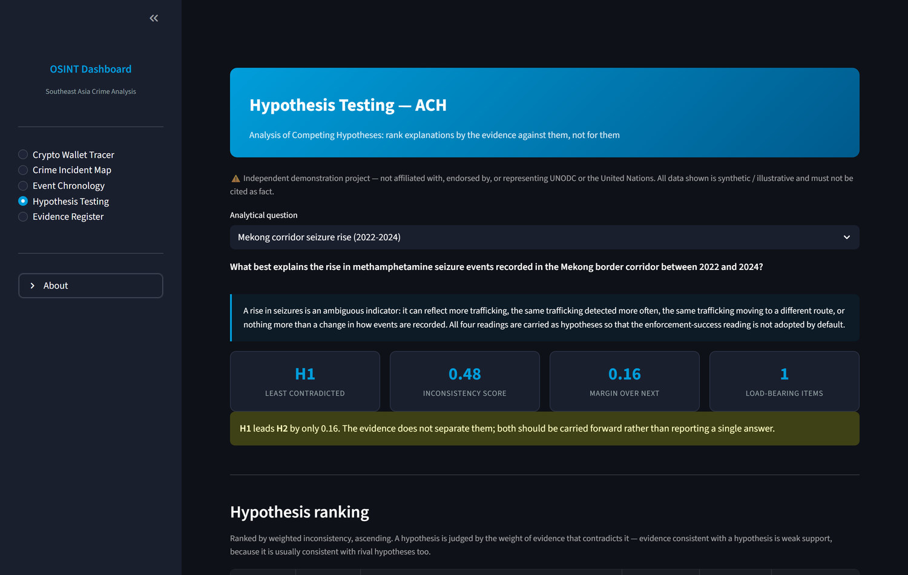
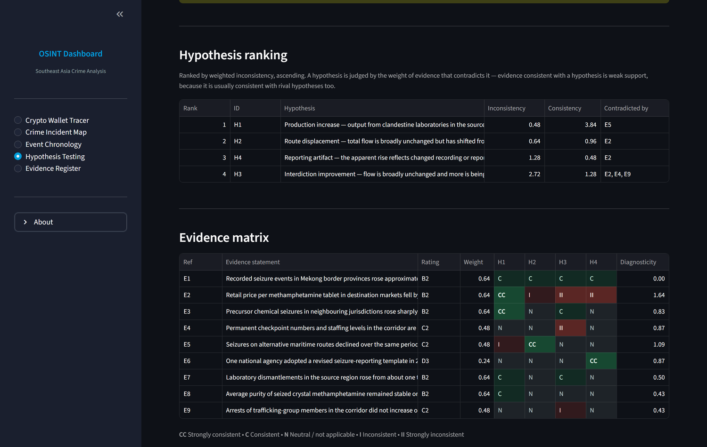
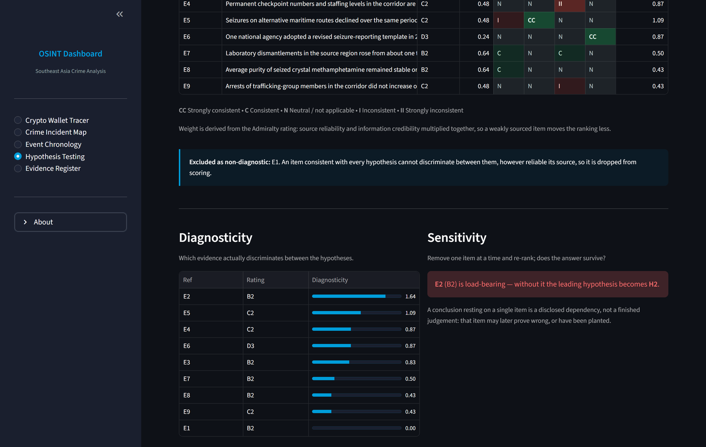
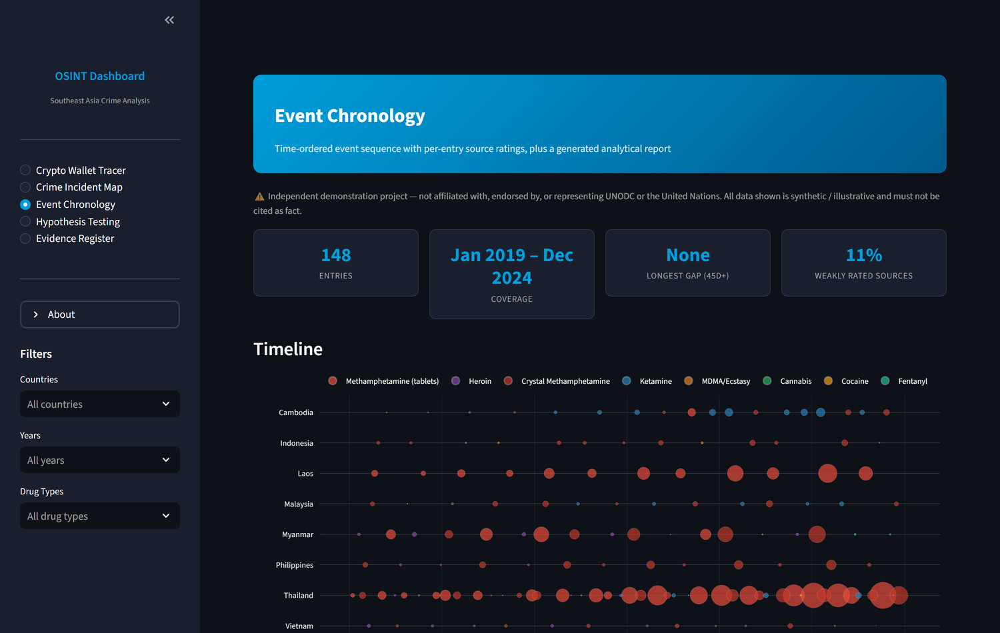
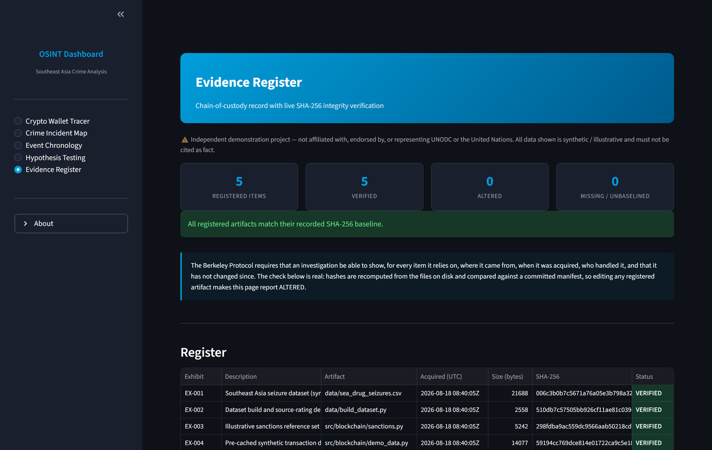
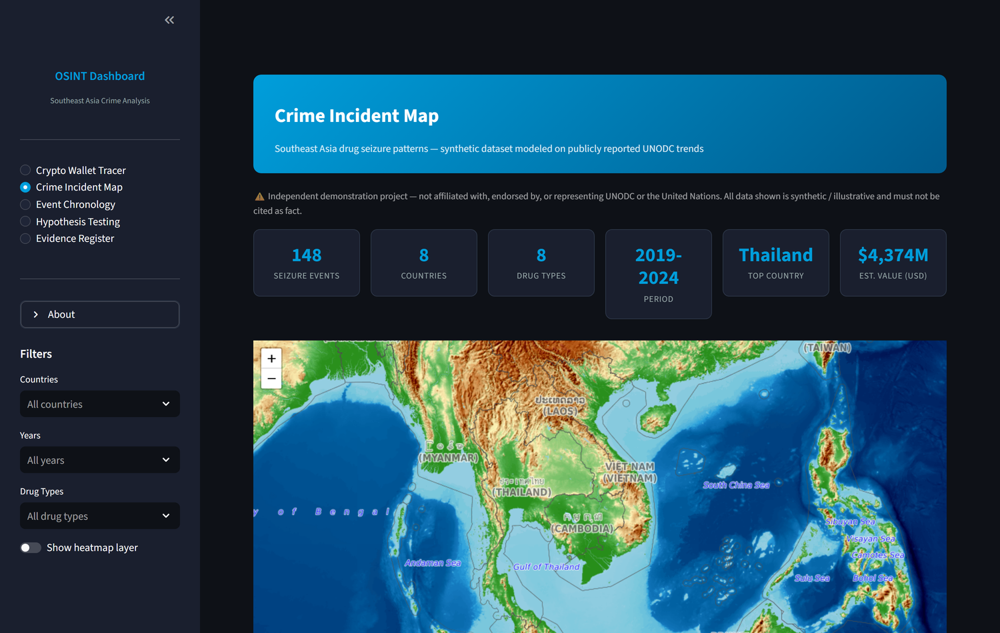
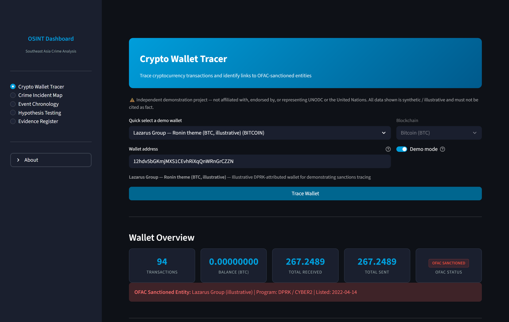

# OSINT Southeast Asia Crime Analysis Dashboard

[](https://osint-sea-analysis.streamlit.app)

An open-source intelligence (OSINT) analytical tool that demonstrates monitoring
and analysis of transnational organized crime in Southeast Asia, with a focus on
cryptocurrency-enabled financial flows and regional drug trafficking patterns.

**▶ Live demo:** https://osint-sea-analysis.streamlit.app

> ⚠️ **Important — read first**
>
> - **Independent project.** This is a personal portfolio/demonstration project.
>   It is **not affiliated with, endorsed by, or representing UNODC or the United
>   Nations**. The UN name and emblem are not used to imply any official status.
> - **Data is synthetic / illustrative.** The drug-seizure records are
>   **synthetic** — modeled on publicly reported UNODC *trends*, but no row is a
>   real, citable incident. The sanctions reference set is **illustrative**: only
>   a few entries reflect genuine OFAC designations (clearly flagged), and the
>   rest pair real threat-actor *names* with placeholder addresses for
>   demonstration. **Nothing here should be cited as fact.**
> - No classified, restricted, or non-public information is included.

## Screenshots

### Hypothesis testing — Analysis of Competing Hypotheses

Explanations are ranked by the evidence *against* them. Here the leading
hypothesis is only 0.16 ahead of its nearest rival, so the interface says so
rather than presenting a single confident answer.



The evidence matrix scores every item against every hypothesis, weighted by its
Admiralty rating. `E1` — the observation that prompted the question in the first
place — scores identically against all four hypotheses, so its diagnosticity is
0.00 and it is excluded from scoring.



Sensitivity analysis removes each item in turn and re-ranks. It reports that the
conclusion rests entirely on `E2`: without that one item the leading hypothesis
changes. That dependency is disclosed rather than buried.



### Event chronology

Events in time order with per-entry source ratings, a timeline sized by
estimated value, and detection of intervals with no recorded activity.



### Evidence register

Chain-of-custody record with live SHA-256 verification. Hashes are recomputed
from the files on disk and compared against a committed manifest, so editing any
registered artifact makes this page report `ALTERED`.



### Crime incident map



### Crypto wallet tracer



## Features

### Crypto Wallet Tracer
- Trace Bitcoin and Tron (USDT-TRC20) wallet transactions
- Interactive network graph visualization of transaction flows
- Cross-referencing against an illustrative OFAC sanctions reference set
- Heuristic laundering-typology indicators (mixer exposure, layering,
  consolidation, round-value structuring)
- Risk scoring based on proximity to sanctioned entities
- Demo wallets with pre-cached synthetic data for immediate exploration

### Crime Incident Map
- Interactive map of (synthetic) drug seizure events across 8 Southeast Asian countries
- Illustrative dataset spanning 2019–2024, modeled on UNODC-reported trends
- Filter by country, year, and drug type
- Heatmap layer for identifying trafficking hotspots
- Analytical charts: trend over time (with year-over-year change), distribution
  by country and drug type
- Per-record **Admiralty Code** source-reliability / information-credibility ratings
- **SHA-256 dataset integrity** digest displayed in the data view
- Exportable filtered datasets

### Event Chronology
- Time-ordered chronology of events, each entry carrying its own source rating
  and reference number
- Interactive **timeline** (events by country over time, sized by estimated value)
  and monthly **event tempo** with cumulative overlay
- **Temporal gap detection** — intervals with no recorded event are surfaced, not
  smoothed over, since a gap may be a genuine lull, a collection blind spot, or a
  reporting interruption
- Source-rating profile for the records in scope
- **Generated analytical report** (Markdown export): key judgement first, a
  confidence level derived from the source profile, and an explicit gaps section

### Hypothesis Testing — ACH
- **Analysis of Competing Hypotheses** over a worked scenario, ranking
  explanations by the evidence *against* them rather than for them
- Colour-coded evidence matrix with per-item **diagnosticity** scoring
- Evidence weighted by its Admiralty rating, so source quality affects the result
- Non-diagnostic evidence identified and excluded from scoring
- **Sensitivity analysis** — flags conclusions that rest on a single report
- Monitoring indicators per hypothesis, turning a judgement into a collection
  requirement

### Evidence Register
- Chain-of-custody register over the project's own evidentiary artifacts
- **Live SHA-256 verification** against a committed manifest: editing any
  registered file makes the page report `ALTERED`
- Per-exhibit origin, acquisition timestamp, handling caveat, and custody log

## Analytic techniques implemented

| Technique | Where | Notes |
|---|---|---|
| Admiralty Code source evaluation | `data/build_dataset.py`, `src/analysis/ach.py` | Reliability A–F × credibility 1–6, converted into evidence weights |
| Analysis of Competing Hypotheses | `src/analysis/ach.py` | Ranked by weighted inconsistency, per Heuer; diagnosticity and sensitivity included |
| Event chronology & timeline | `src/analysis/chronology.py` | Narrative chronology, timeline, tempo, temporal gap detection |
| Link / network analysis | `src/blockchain/graph.py` | Directed transaction graph, value-weighted edges |
| Chain of custody & integrity | `src/evidence.py`, `src/integrity.py` | SHA-256 baseline manifest with live verification |
| Structured reporting | `src/reporting.py` | BLUF structure, derived confidence level, explicit gaps |

## Tradecraft & methodology

This tool is built around standard open-source-investigation practice, following
the [Berkeley Protocol on Digital Open Source Investigations](https://www.ohchr.org/en/publications/policy-and-methodological-publications/berkeley-protocol-digital-open-source)
(UN Human Rights, 2022). See [METHODOLOGY.md](METHODOLOGY.md) for the full write-up.

Key principles applied:
- **Source evaluation** — records are rated on the Admiralty/NATO scale
  (source reliability A–F, information credibility 1–6), and those ratings carry
  through into how much each item can move an analytical conclusion
- **Data integrity** — SHA-256 digests are computed over the registered artifacts
  and checked against a committed manifest, so tampering is detected rather than
  merely deterred
- **Structured reasoning** — competing explanations are tested by seeking
  refutation, and conclusions that depend on a single report are disclosed
- **Honest provenance** — synthetic data is labeled as synthetic everywhere; no
  fabricated record is presented as a real, sourced report
- **Stated gaps** — every generated report ends with what is *not* known, and
  confidence is derived from the sourcing rather than asserted
- **Ethical collection** — live mode queries only publicly available on-chain data
- **Reproducibility** — the dataset is produced by a documented build step
  (`data/build_dataset.py`), and the analytical logic is covered by tests

## Data sources

| Source | Type | Use in this project |
|--------|------|---------------------|
| [Blockchair](https://blockchair.com) | Bitcoin blockchain data | Live mode (free API) |
| [TronGrid](https://www.trongrid.io) | Tron / USDT-TRC20 data | Live mode (free API) |
| [OFAC SDN List](https://sanctionssearch.ofac.treas.gov/) | Sanctioned crypto addresses | Basis for an *illustrative* reference set — verify against the official list for any real use |
| [UNODC Data Portal](https://dataunodc.un.org/) | Drug seizure statistics | Trend basis for the *synthetic* seizure dataset (no row is a real record) |

## Quick Start

```bash
# Clone the repository (replace with your fork URL)
git clone https://github.com/acharaj956/osint-sea-analysis.git
cd osint-sea-analysis

# Create virtual environment
python -m venv venv
source venv/bin/activate  # On Windows: venv\Scripts\activate

# Install dependencies
pip install -r requirements.txt

# (Optional) regenerate the illustrative dataset with provenance metadata
python data/build_dataset.py

# (Optional) re-record the SHA-256 custody baseline after an intended data change
python -m src.evidence

# Run the dashboard
streamlit run app.py
```

The app runs in **demo mode** by default, using pre-cached synthetic data. No API keys required.

### Optional: Enable live API queries

```bash
cp .env.example .env
# Edit .env with your API keys (all free tier)
```

## Tech Stack

- **Python 3.10+**
- **Streamlit** — Interactive dashboard framework
- **NetworkX + Pyvis** — Transaction network graph analysis and visualization
- **Folium** — Geospatial mapping with interactive markers and heatmaps
- **Pandas** — Data processing and analysis
- **Plotly** — Statistical charts and analytics
- **Requests** — API client for blockchain data

## Project Structure

```
osint-sea-analysis/
├── app.py                     # Main Streamlit application
├── requirements.txt           # Pinned dependencies
├── .env.example               # Environment variable template
├── METHODOLOGY.md             # Tradecraft, source rating, integrity notes
├── .streamlit/config.toml     # Streamlit theme configuration
├── data/
│   ├── sea_drug_seizures.csv  # Synthetic, UNODC-trend-based seizure dataset
│   ├── build_dataset.py       # Reproducible dataset build / enrichment step
│   └── evidence_manifest.json # SHA-256 custody baseline for registered artifacts
├── tests/
│   └── test_analysis.py       # Tests for ACH, chronology, integrity, reporting
└── src/
    ├── config.py              # Application configuration
    ├── styles.py              # UI styling and components
    ├── integrity.py           # SHA-256 data-integrity helpers
    ├── evidence.py            # Evidence register & chain-of-custody verification
    ├── reporting.py           # Analytical report generation
    ├── analysis/
    │   ├── ach.py             # Analysis of Competing Hypotheses engine
    │   ├── scenarios.py       # Worked ACH scenario (illustrative)
    │   └── chronology.py      # Chronology, timeline, tempo, gap detection
    ├── blockchain/
    │   ├── client.py          # Blockchair & TronGrid API clients
    │   ├── graph.py           # Network graph construction & rendering
    │   ├── sanctions.py       # Illustrative OFAC sanctions reference set
    │   ├── typologies.py      # Heuristic laundering-typology indicators
    │   └── demo_data.py       # Pre-cached synthetic transaction data
    └── crime_map/
        ├── loader.py          # Data loading, filtering, statistics
        └── builder.py         # Folium map construction
```

## Tests

The analytical logic is covered by tests — the ACH scoring rules, Admiralty
weighting, chronology construction, integrity verification, and report
generation:

```bash
pip install -r requirements-dev.txt
python -m pytest
```

## Data dictionary (`data/sea_drug_seizures.csv`)

| Column | Description |
|--------|-------------|
| `id` | Record identifier |
| `date` | Seizure date (synthetic) |
| `country`, `province`, `city` | Location |
| `lat`, `lon` | Coordinates |
| `drug_type` | Substance category |
| `quantity`, `unit` | Amount seized |
| `estimated_value_usd` | Illustrative estimated street value (USD) |
| `seizure_context` | Scenario context (e.g. border checkpoint, lab dismantlement) |
| `provenance` | Always "Synthetic (illustrative)" |
| `source_reliability` | Admiralty source-reliability rating (A–F) |
| `info_credibility` | Admiralty information-credibility score (1–6) |
| `admiralty_rating` | Combined rating (e.g. "B2") |

## Limitations

- Blockchain analysis is limited to 1-hop transaction tracing (direct counterparties only)
- The seizure dataset is **synthetic**; it illustrates patterns, not real events
- Laundering-typology indicators are simple heuristics, not a production classifier
- The sanctions reference set is illustrative and static; production use requires
  loading and verifying against the live OFAC SDN list
- Demo mode uses synthetic transaction data

## Roadmap (not yet implemented)

- Public news / event monitoring (e.g. GDELT) for corroboration
- Image/video metadata (EXIF) extraction and geolocation
- Multi-hop tracing and automated typology classification

## License

MIT License. See [LICENSE](LICENSE) for details.

## Disclaimer

This tool is built for analytical demonstration and learning purposes only. It is
not affiliated with any organization. The seizure dataset is synthetic and modeled
on publicly reported trends; blockchain analysis in live mode uses only publicly
available on-chain data. No classified, restricted, or non-public information is
included, and nothing in this project should be cited as fact.
